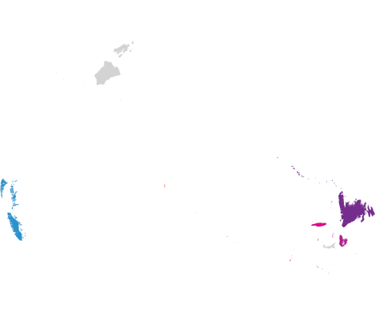

# The Canadian Cystic Fibrosis Gene Modifier Study

The Canadian Cystic Fibrosis Gene Modifier Study is a Canada-wide study recuiting individuals with cystic fibrosis (CF) for DNA sequencing.

Individuals are consented to have blood drawn and sequenced at the The Centre for Applied Genomics (TCAG) at The Hospital for Sick Children in Toronto, Ontario.

## Centre Participants
**Participants from 9 provinces across Canada**

 St. Paul’s Hospital, BC Children’s Hospital, Royal Jubilee Hospital†, Victoria General Hospital†  

 University of Alberta Hospitals, Alberta Children’s Hospital, Foothills Medical Centre  

 Royal University Hospital, Regina General Hospital  

 Winnipeg Health Sciences Centre  

 The Hospital for Sick Children, St. Michael’s Hospital, London Health Sciences Centre, Hamilton Health Sciences, Children’s Hospital of Eastern Ontario, Grand River Hospital, Sudbury Regional Hospital, The Ottawa Hospital, Kingston Health Sciences Centre  

 Centre hospitalier de l’Université de Montréal (CHUM), University Institute of Cardiology and Respirology of Quebec, CHU Sainte-Justine, Centre de santé et de services sociaux de Chicoutimi, Montreal Chest Institute (MUHC), Montreal Children’s Hospital, Centre hospitalier universitaire de Sherbrooke, Hôpital régional de Rimouski, Hôpital de Rouyn-Noranda  

 Saint John Regional Hospital  

 IWK Health Centre, QEII Health Sciences Centre  

 Janeway Children’s Health & Rehabilitation Centre  

(† indicates centres with no further enrolment)

# Canadian Cystic Fibrosis Gene Modifier Consortium

**Study PI**: Lisa J Strug1
**Study Coordinator**: Katherine Keenan1

**Site PIs**:

Lisa J Strug1, Felix Ratjen1, Johanna Rommens1, Melinda Solomon1, Candice Bjornson2, Mark Chilvers3, Joe Reisman4, April Price5, Shaikh Iqbal6, Michael Parkins7, Linda Pineau8, Michael Derynck9, Emmanuelle Brochiero10, Lara Bilodeau11, Dimas Mateos-Corral12, Mary Jane Smith13, Nita Chauhan15, Heather Racz16, Liz Tullis17, Anne Stephenson17, Bradey Quon18, Pearce Wilcox18, Winnie M Leung19, Jaled Yehya19, Lei Sun20, Christelle Bergeron22, Larry Lands23

**Past contributing PIs**:

Raquel Consunji-Araneta6, Richard van Wylick9, Daniel Hughes12, Nancy Morrison14, Janna Brusky15, Mary Jackson16, Yves Berthiaume21, Andre Cantin22

---

 The Hospital for Sick Children, Toronto, ON, Canada.  
 Alberta Children’s Hospital, Calgary, AB, Canada.  
 BC Children’s Hospital, Vancouver, BC, Canada.  
 Children’s Hospital of Eastern Ontario, Ottawa, ON, Canada.  
 Children’s Hospital of Western Ontario (London Health Sciences Centre), London, ON, Canada.  
 Children’s Hospital of Winnipeg, Winnipeg, MB, Canada.  
 Foothills Medical Centre, Calgary, AB, Canada.  
 Grand River Hospital, Kitchener, ON, Canada.  
 Kingston Health Sciences Centre, Kingston, ON, Canada.  
 Centre hospitalier de l’Université de Montréal (CRCHUM), Montréal, QC, Canada.  
 Institut universitaire de cardiologie et de pneumologie de Québec (IUCPQ), Québec, QC, Canada.  
 IWK Health Centre, Halifax, NS, Canada.  
 Janeway Children’s Health & Rehabilitation Centre, St. John’s, NL, Canada.  
 Queen Elizabeth II Health Sciences Centre, Halifax, NS, Canada.  
 Royal University Hospital, Saskatoon, SK, Canada.  
 St. Mary’s General Hospital, Kitchener, ON, Canada.  
 St. Michael’s Hospital, Toronto, ON, Canada.  
 St. Paul’s Hospital, Vancouver, BC, Canada.  
 University of Alberta Hospital, Edmonton, AB, Canada.  
 University of Toronto, Toronto, ON, Canada.  
 Department of Medicine, Faculty of Medicine, Université de Montréal, Montréal, QC, Canada.  
 Centre hospitalier universitaire de Sherbrooke (CHUS), Sherbrooke, QC, Canada.  
 Montreal Children’s Hospital, Montréal, QC, Canada.  

# Data

https://hifisolves.org/collections/canadian-cystic-fibrosis-hifi-dataset/overview

# Publications
- Gong, Jiafen et al. “[Genetic evidence supports the development of SLC26A9 targeting therapies for the treatment of lung disease.](https://pubmed.ncbi.nlm.nih.gov/35396391/)” NPJ genomic medicine vol. 7,1 28. 8 Apr. 2022, doi:10.1038/s41525-022-00299-9
- Mastromatteo, Scott et al. “[High-quality read-based phasing of cystic fibrosis cohort informs genetic understanding of disease modification.](https://pubmed.ncbi.nlm.nih.gov/36386424/)” HGG advances vol. 4,1 100156. 20 Oct. 2022, doi:10.1016/j.xhgg.2022.100156
